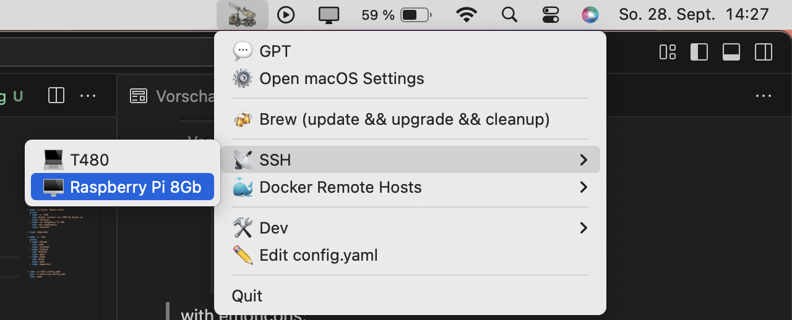

# TaskTray App

A **cross-platform Python tray application** to quickly launch links, commands, and applications from a system tray menu. Supports Windows, macOS, and Linux.

---

## Features

- **Tray icon menu** with customizable links and commands.  
- Supports different command types ("type:"):
  - `browser` → opens a URL in the default browser.
  - `terminal` → opens a command in a terminal window.
  - `open` → opens files or applications with the default OS handler.
  - `silent` → executes background commands without opening a window (default).
  - `separator` → adds a menu separator.  
- **Nested menus** and grouping support ("group:").  
- **Custom Environment variables** per task ("env:").
- **Cross-platform startup**:
  - Windows: adds registry entry.  
  - macOS: LaunchAgent.  
  - Linux: `.desktop` autostart.  
- Automatically loads configuration and environment variables from `~/.task-tray`.  
- Optional **icon.png** for tray icon.  

---

## Installation

1. Clone the repository or copy the files to a folder.  
2. Make sure you have Python 3.10+ installed.  
3. Run the installer:

```bash
# download deps
uv sync

# activate env
. .venv/bin/activate

# install 
python install.py --install
```

## Manual Run

```bash
python main.py <test-folder>
```
When test folder is specified then it will load the config.yaml from there and write the logs in this folder.


## Screenshots
 Default menu:


with emoticons:




## Resources
The launcher icon is provided by https://www.flaticon.com/authors/maxicons from the battlefield-2 collection in  the FlatIcons website.

## Config example
```yaml
links:
  - name: Open Google
    cmd: https://www.google.com
    type: browser

  - name: Open GitHub
    cmd: https://github.com
    type: browser

  - name: Open macOS Settings
    cmd: "/System/Applications/System Settings.app"
    type: open

  - type: separator

  - name: AWS SSO Login
    cmd: aws sso login
    type: terminal

  - name: Connect to Postgres via SSM
    cmd: aws ssm start-session --target i-0123456789abcdef0 --document-name AWS-StartPortForwardingSession --parameters '{"portNumber":["5432"],"localPortNumber":["5432"]}'
    type: terminal

  - type: separator

  - name: Kubernetes Port Forward Pod1
    cmd: kubectl port-forward svc/service1 9000:9000
    type: terminal

  - name: Kubernetes Port Forward Pod2
    cmd: kubectl port-forward svc/service2 8080:8080
    type: terminal

  - type: separator

  - name: Ping Google
    cmd: ping -c 4 google.com
    type: terminal

  - name: List Network Interfaces
    cmd: ifconfig
    type: terminal

  - type: separator

  - name: Run background command
    cmd: echo "Hello World" > ~/Desktop/hello.txt
    type: silent

  - name: Nested Group Example
    group:
      - name: Ping Google
        cmd: ping -c 4 google.com
        type: terminal
      - name: Open Docs
        cmd: ~/Desktop/hello.txt
        type: open

```

Example with emoticons and enviremnt variables:

```yaml
links:
  - name: 💬 GPT
    cmd: https://chatgpt.com
    type: browser

  - name: ⚙️ Open macOS Settings
    cmd: "/System/Applications/System Settings.app"
    type: open

  - type: separator

  - name: 🍻 Brew (update && upgrade && cleanup)
    cmd: brew update && brew upgrade && brew cleanup
    type: terminal

  - type: separator

  - name: 📡 SSH
    group:
    # identity_file: ~/.ssh/id_rsa_stephen
    - name: 💻 T480
      cmd: ssh stephen@stephen-t480
      type: terminal
    # identity_file: ~/.ssh/id_rsa_pi
    - name: 🖥️ Raspberry Pi 8Gb
      cmd: ssh stephen@rpi
      type: terminal
  
  - name: 🐳 Docker Remote Hosts
    group:
    - name: 💻 T480
      cmd: docker ps
      env:
        DOCKER_HOST: ssh://stephen@stephen-t480
      type: terminal
    - name: 🖥️ Raspberry Pi 8Gb
      cmd: ssh stephen@rpi
      env:
        DOCKER_CONTEXT: rpi
      type: terminal

  - type: separator
  
  - name: 🛠️ Dev
    group:
    - name: TODO
      cmd: code
      type: terminal
    - name: 📁 File Explorer - Projects
      cmd: ~/Projects
      type: open

    
  - name: ✏️ Edit config.yaml
    cmd: ~/.task-tray/config.yaml
    type: open
```